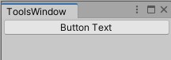
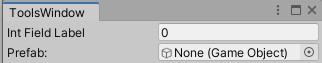

## Selection Base

To force Unity to select the GameObject on click - add `[SelectionBase]` line over `public class XXX : ...` to any
script that is attached to that GameObject

## Custom Editor Window

To create your own editor window:

1. Create an `Editor` folder somewhere in your project
2. Create a script
3. Paste the following template and replace `[YourFileName]` with the name of that script
4. To change the location and button name for your window change the line with `[MenuItem(...)]`

```c#
using UnityEditor;  
  
public class [YourFileName]: EditorWindow  
{  
    [MenuItem("Window/My Window")]  
    public static void ShowWindow()  
    {  
        GetWindow(typeof([YourFileName]));  
    }  
  
    private void OnGUI()  
    {  
        // Your custom window code goes here...  
    }  
}
```

## Custom Buttons



To add a button add the following piece to `OnGUI`:

```c#
if(GUILayout.Button("Button Text"))
{
	//Code here will be executed when you click on the button
}
```

## Custom Fields



To add a field to store/input some data you will need to follow this structure:

### For simple types (int, string, float, Vector3, etc.)

```c#
//As an example a float is used, but this can me anything like int, string, Vector3, etc.
float floatInput;

///Somewhere in OnGUI:
//This line should be added before you use the value itself
floatInput = EditorGUILayout.FloatField("Float Field Label", floatInput);

```

### For objects (GameObject, Sprite, Image, any asset, other scripts)

The main difference is that the method used is `ObjectField` and two places where you need to put the type of the object
you need. In this example a `GameObject` is used, so if you want to use other type replace it in 3 occurrences

```c#
GameObject gameObjectInput;

///Somewhere in OnGUI:
//This line should be added before you use the value itself
gameObjectInput = (GameObject) EditorGUILayout.ObjectField("Prefab Label", gameObjectInput, typeof(GameObject);
```

## Other GUI elements

The list of all available elements is available in the following Unity documentation pages:

* [GUILayout](https://docs.unity3d.com/ScriptReference/GUILayout.html)
* [EditorGUILayout](https://docs.unity3d.com/ScriptReference/EditorGUILayout.html)

## Font replace snippet

For TextMeshPro:

```c#
//In class
TMP_FontAsset replaceFont;


//OnGUI part
replaceFont = (TMP_FontAsset) EditorGUILayout.ObjectField("Replace font:", replaceFont, typeof(TMP_FontAsset), false, null);

if (GUILayout.Button("Replace fonts"))
{
    var texts = StageUtility.GetCurrentStage().FindComponentsOfType<TextMeshProUGUI>();
    Undo.RecordObjects(texts, "Change fonts");
    foreach (TextMeshProUGUI text in texts)
    {
        text.font = replaceFont;
        EditorUtility.SetDirty(text);
    }
}
```

For standard Unity Text:

```c#
//In class
Font replaceFont;


//OnGUI part
replaceFont = (Text) EditorGUILayout.ObjectField("Replace font:", replaceFont, typeof(Text), false, null);

if (GUILayout.Button("Replace fonts"))
{
    var texts = StageUtility.GetCurrentStage().FindComponentsOfType<Text>();
    Undo.RecordObjects(texts, "Change fonts");
    foreach (Text text in texts)
    {
        text.font = replaceFont;
        EditorUtility.SetDirty(text);
    }
}
```

## Spawn prefabs snippet

```c#
//In class
GameObject prefab;


//OnGUI part
prefab = (GameObject) EditorGUILayout.ObjectField("Prefab:", prefab, typeof(GameObject), false);

if (GUILayout.Button("Spawn prefabs"))
{
    //Loops to be added here
    var prefabInstance = (GameObject) PrefabUtility.InstantiatePrefab(prefab);

    // Use prefabInstance to change position, add/change components, etc.

    EditorSceneManager.MarkSceneDirty(EditorSceneManager.GetActiveScene());
}
```

## Game Config

To implement Game Config to your game:

1. Create a script with the following content:

```c#
[CreateAssetMenu]
public class GameConfig : ScriptableObject
{
    //Your variables to be put here

    public static GameConfig Instance
    {
        get
        {
            if (_instance == null)
            {
                _instance = Resources.Load<GameConfig>("Game Config");
    
                if (_instance == null)
                {
                    throw new DataException(
                        "Can't find Game Config! Please check that it exists and is located at: Assets/Resources/Game Config");
                }
            }
    
            return _instance;
    }
    
    private static GameConfig _instance;
}
```

2. Create a `Resources` folder in the root of `Assets`

3. In that folder right-click in project view and select `Create`->`Game Config`

4. Name it `Game Config` (!)

(optional) 4.1. Remove `[CreateAssetMenu]` line from the script to prevent creating new config files

5. Add the fields you need to the config and from the game scripts access it by
   writing `GameConfig.Instance.[YourVariable]`

(optional) 5.1. Use this template to prohibit changing the values of your variables (because changing them won't work in
the build):

```c#
[field: SerializeField]
public TYPE NAME { get; private set; }
```

Replace `TYPE` to `int, float, GameObject, etc.` and `NAME` to a preferred variable name

## Naughty Attributes

Just use it, yo: [Naughty Attributes](https://github.com/dbrizov/NaughtyAttributes)
